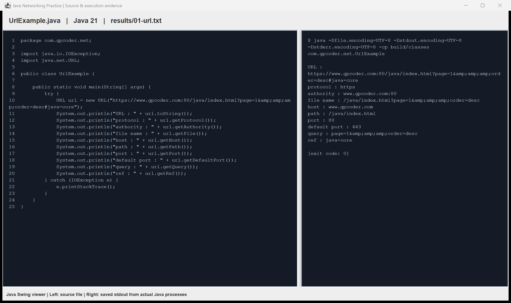
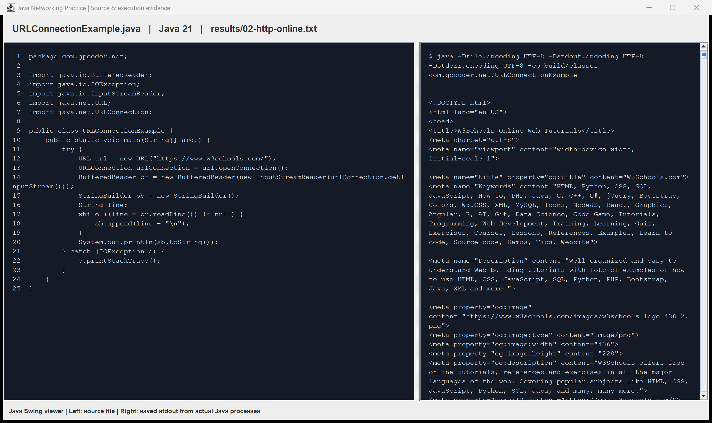
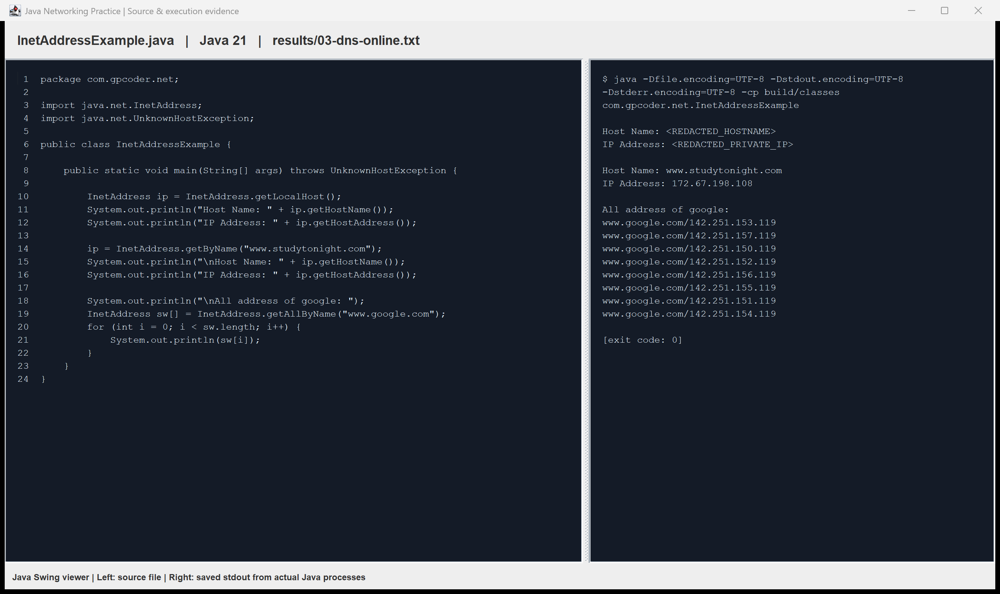
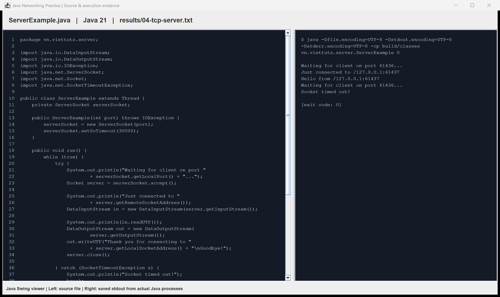
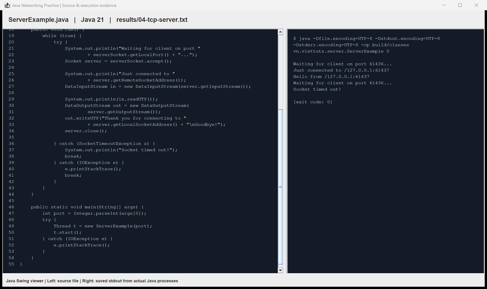
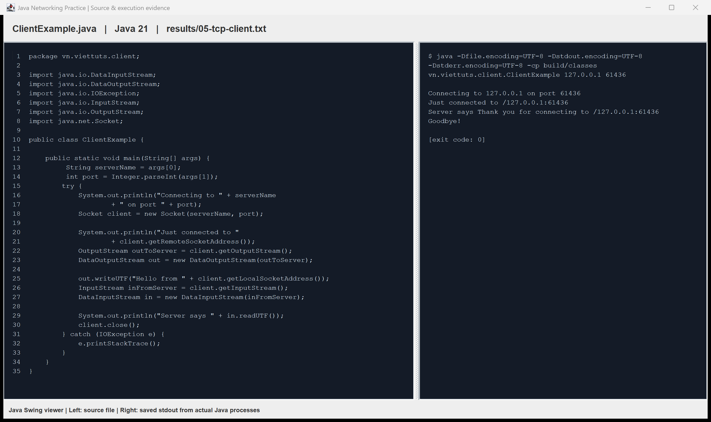

# Lập trình mạng với Java

Code mẫu từ [GP Coder](https://gpcoder.com/3664-lap-trinh-mang-voi-java/)
và [VietTuts](https://viettuts.vn/lap-trinh-mang-voi-java), đã bỏ chú thích trong code.
Giữ package, tên lớp, luồng xử lý và chuỗi trong các đoạn mẫu trên trang.

## Mã nguồn

| Bài mẫu | File |
|---|---|
| URL — GP Coder | [UrlExample.java](src/com/gpcoder/net/UrlExample.java) |
| URLConnection — GP Coder | [URLConnectionExample.java](src/com/gpcoder/net/URLConnectionExample.java) |
| InetAddress — GP Coder | [InetAddressExample.java](src/com/gpcoder/net/InetAddressExample.java) |
| TCP server — VietTuts | [ServerExample.java](src/vn/viettuts/server/ServerExample.java) |
| TCP client — VietTuts | [ClientExample.java](src/vn/viettuts/client/ClientExample.java) |

## Chạy

Yêu cầu JDK 21. Mở PowerShell tại thư mục repository:

```powershell
.\build.ps1
java -cp build/classes com.gpcoder.net.UrlExample
java -cp build/classes com.gpcoder.net.URLConnectionExample
java -cp build/classes com.gpcoder.net.InetAddressExample
```

Chạy server trong terminal thứ nhất:

```powershell
java -cp build/classes vn.viettuts.server.ServerExample 6677
```

Chạy client trong terminal thứ hai:

```powershell
java -cp build/classes vn.viettuts.client.ClientExample 127.0.0.1 6677
```

Server mẫu chờ các kết nối tiếp theo và dừng khi không có kết nối trong 30 giây.
Hai ví dụ URLConnection và InetAddress cần Internet. Constructor `new URL(...)`
của mẫu có cảnh báo deprecated trên Java 21 nhưng vẫn biên dịch và chạy được.
Chuỗi `&amp;amp;amp;` trong ví dụ URL được giữ đúng như đoạn code hiển thị trên bài GP Coder.

Chạy tự động cả năm ví dụ (cần Python 3):

```powershell
python run_examples.py
```

Script chọn cổng TCP trống, kiểm tra dữ liệu gửi/nhận và lưu kết quả trong `results/`.
Xem [kết quả kiểm tra](results/summary.txt). Tên máy và IP nội bộ được ẩn trong log công khai.

Để mở bằng Eclipse: **File → Import → General → Existing Projects into Workspace**,
chọn thư mục repository, dùng JDK 21 và UTF-8. Run As → Java Application;
đặt Arguments cho server là `6677`, client là `127.0.0.1 6677`.

## Screenshot

Ảnh chụp cửa sổ Java Swing hiển thị file code mẫu và log chạy thật đã lưu.
Ảnh server chia hai phần để đọc đủ code. Tạo lại ảnh sau khi chạy các ví dụ:

```powershell
javac -encoding UTF-8 -d build/tools tools/PracticeViewer.java
java -cp build/tools PracticeViewer
```







